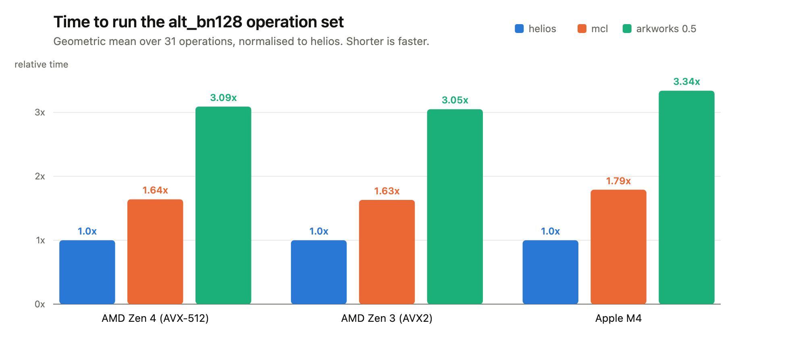
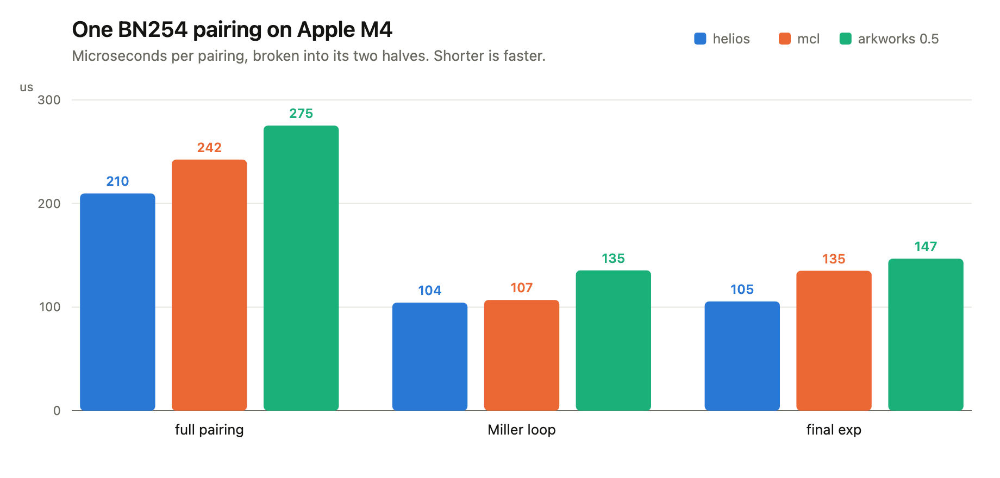
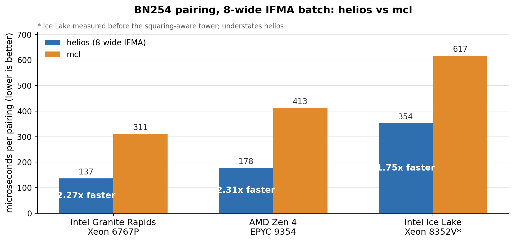

# helios-bn254

BN254 arithmetic for the operations a Solana validator runs in consensus: multi-scalar multiplication, pairing checks, and field work over the `alt_bn128` byte format. It does one job, verifying proofs over public inputs, and it does it quickly.

## Why this exists

Solana validators already run BN254 in consensus. The Agave client exposes it through `alt_bn128` syscalls for group operations, pairings, and field arithmetic, with more on the way as SIMD-friendly batch syscalls land. On a validator these calls are not academic. They sit on the path a block takes to get produced, and there have been live moments where the cost of the arithmetic itself, not the code around it, was the thing in the way. A pairing check that takes a few hundred microseconds instead of a few thousand is the difference between headroom and a problem you get paged about.

So the arithmetic got its own crate, and the crate got a narrow brief: be the fastest way to run exactly those operations, on the Linux servers validators actually sit on.

## Why not just use arkworks

You should, for almost everything. arkworks is the BN254 library in the Rust ecosystem, it is correct, it covers the whole curve and then some, and we use `ark-bn254` as a test oracle precisely because we trust it more than we trust ourselves.

General is the catch. A library that has to serve proving, serialization, a dozen curves, and every operation anyone might ever want makes different choices than one that only ever verifies. Verification is a small country. It touches a narrow set of operations, always over public inputs, and if you move there and spend the whole codebase on that one constraint, things get faster. gnark's [eccbench](https://hackmd.io/@gnark/eccbench) was the nudge: it showed gnark-crypto slipping past herumi/mcl on this exact curve, which meant mcl's long-standing lead was not a law of physics. Somebody just had to go and look. We went and looked.

## Numbers

Narrow problems reward attention, and this is what the attention bought. Measured end to end through the byte API, against arkworks 0.5 and herumi/mcl, the two implementations worth measuring against.



Across all 31 operations the arithmetic lands at roughly a third of arkworks' time and comfortably under mcl's, on Apple silicon and on AMD Zen 3 and Zen 4. The blue bars are ours. mcl is hand-written C++ driving a runtime assembler and has been the number to know for years, so it is worth pointing out that it is the orange one, and that the orange one is not winning.

Zoom into a single pairing on the machine we write the code on, split into its two halves, the Miller loop and the final exponentiation:



Shorter in every column. Nothing clever is happening in any single one of them. It is a pile of small decisions, each worth a few percent, arranged so they do not cancel each other out. The largest gaps show up where the field work dominates: a linear combination of scalars runs anywhere from three to twelve times faster than arkworks, and the G2 subgroup check about 2.7 times faster than mcl.

On the very smallest inputs, the ones where setup cost outweighs the actual maths, mcl still edges ahead by a percent or three. We are not precious about it.

These are single-thread Criterion medians, same host and same flags for all three libraries in each row, taken in July 2026. Read them as a careful measurement, not a warranty. Your Zen 4 is not our Zen 4.

### Batches, on the servers validators sit on

A validator checking a block of proofs does not run one pairing, it runs a batch of them, and that is where the newest tier lands. AVX-512 IFMA turns a batch into eight-at-a-time: eight independent pairings ride the lanes of one instruction stream, their Miller loops run together in the radix-52 domain, and a single final exponentiation covers the whole group. mcl has no BN254 IFMA path at all, so on the Intel and AMD servers that carry AVX-512 there is nothing on the other side of the lane.



A full pairing lands at 137 microseconds on Granite Rapids, 178 on Zen 4, and 354 on Ice Lake, against mcl's 311, 413, and 617 on the same silicon: 2.27, 2.31, and 1.74 times, and the margin grows with the batch as the one final exponentiation amortizes over more pairs; at sixty-four pairs Granite Rapids does 67 microseconds per pairing. Ice Lake trails for a plain reason, one IFMA port against the others' two; its number also predates the squaring-aware tower, so it understates helios. A single pairing cannot fill eight lanes, so below eight terms the check stays on the scalar path, which pays none of the domain-conversion cost; the fast path arrives exactly when there is a batch to be fast about.

## Quickstart

Pairing check, `e(P, Q) * e(-P, Q) = 1`:

```rust
use helios_bn254::{G1Affine, G2Affine, G1Bytes, G2Bytes, PairBytes, pairing_product_is_one};

let p = G1Affine::generator();
let q = G2Affine::arkworks_generator();
let pairs = [
    PairBytes { g1: G1Bytes::from_affine(&p), g2: G2Bytes::from_affine(&q) },
    PairBytes { g1: G1Bytes::from_affine(&p.neg()), g2: G2Bytes::from_affine(&q) },
];
assert!(pairing_product_is_one(&pairs)?);
# Ok::<(), helios_bn254::InputError>(())
```

G1 multi-scalar multiplication, `3*G + 1*(2G) = 5G`:

```rust
use helios_bn254::{Fr, G1Affine, G1Bytes, G1Projective, ScalarBytes, g1_msm};

let g = G1Affine::generator();
let two_g = G1Projective::from(g).double().to_affine();
let points = [G1Bytes::from_affine(&g), G1Bytes::from_affine(&two_g)];
let scalars = [
    ScalarBytes::from_fr(Fr::from_u64(3)),
    ScalarBytes::from_fr(Fr::from_u64(1)),
];
let five_g = G1Projective::from(g).mul(Fr::from_u64(5)).to_affine();
assert_eq!(g1_msm(&points, &scalars)?, G1Bytes::from_affine(&five_g));
# Ok::<(), helios_bn254::InputError>(())
```

Fr batch inversion, checked with a linear combination `<values, values^{-1}> = n`:

```rust
use helios_bn254::{Fr, ScalarBytes, fr_batch_invert, fr_lincomb};

let values = [
    ScalarBytes::from_fr(Fr::from_u64(2)),
    ScalarBytes::from_fr(Fr::from_u64(3)),
];
let inverses = fr_batch_invert(&values)?;
let sum = fr_lincomb(&values, &inverses)?;
assert_eq!(sum, ScalarBytes::from_fr(Fr::from_u64(2)));
# Ok::<(), helios_bn254::InputError>(())
```

The production surface is the Agave-shaped byte facade: G1 MSM, boolean pairing-product check, Fr linear combination, and Fr batch inversion, all over canonical big-endian bytes with consensus-stable validation order, error taxonomy, caps, and infinity handling. Agave's `Version`, `Pod*`, `AltBn128BatchError`, and `alt_bn128_*` spellings are exported directly; the shorter `G1Bytes` and `g1_msm` names are the same code path.

Encoding is `x | y` for G1 (64 bytes), `x1 | x0 | y1 | y0` for G2 (128 bytes), and canonical 32-byte big-endian Fr scalars, with all-zero point bytes meaning infinity. Non-canonical values are rejected, never quietly reduced. Caps are 2048 MSM points, 256 pairs, and 2048 Fr elements per call. Curve parameters match `ark-bn254` and mcl `CurveParam BN_SNARK1`.

## Security

It leaks timing on purpose. Running time, branches, and memory access all depend on the input values, which is what makes it fast and also why you must never point it at a secret. Feed it a private key or a witness and it will happily hand an attacker a side channel. A verifier only ever sees public inputs, so for that job the trade costs nothing. For anything secret-dependent it is a CVE with your name already on it.

Not audited yet. One is planned. The differential testing against arkworks 0.5 and mcl vectors is thorough and catches bugs, but bugs are not adversaries, so size the risk accordingly.

## How it works

The speed is a stack of small things, not one big one. The pairing tower runs Longa sums-of-products Montgomery arithmetic (ePrint 2022/367), one reduction per sum of products rather than one per product. The G2 subgroup check is the El Housni-Guillevic-Piellard single-`[x]` membership test (ePrint 2022/352). Inversion is Kaliski's Montgomery inverse with correction tables built at compile time. MSM stacks GLV splitting, joint wNAF, co-Z shared-Z tables, and a window-major batch-affine Pippenger. On AVX-512 targets a batch of pairing checks goes wider still: eight pairings run at once across the IFMA lanes, the same tower arithmetic carried in radix-52 form, under one shared final exponentiation.

Under all of it, the per-target field kernels are generated from a small Rust schedule description at build time and checked by a bit-accurate interpreter before they are ever assembled, so the aarch64 leaf, the x64 ADX kernels, and the AVX-512 IFMA batch path all come from one readable source rather than a pile of hand-written assembly nobody wants to open. If you are curious, `HELIOS_DUMP_ASM=<dir>` writes out what it emitted. Every constant in the crate, from the moduli to the Frobenius coefficients, is derived from the curve seed at compile time, pinned by an assertion, and cross-checked against arkworks in the tests.

## Platform tiers

| Tier | Active when | Scope |
|---|---|---|
| Portable Rust | any target, and always under `force-portable` | everything |
| AArch64 Apple leaf | `aarch64-apple-*` targets | Montgomery-multiply leaf |
| x64 ADX | x64 Linux with `bmi2`+`adx` features | mont mul/sqr and the tower kernels |
| AVX-512 IFMA | `avx512f`+`avx512ifma` features | 8-way batched mul in MSM buckets and the batch pairing check |

Tier selection is a compile-time property of the target. There is no runtime dispatch and no silent fallback: `HELIOS_AVX512_IFMA=1` forces the IFMA tier and fails the build if the target cannot honor it, `=0` denies it. What you compiled for is what you get.

## Install

no_std plus alloc, by default, because this drops into on-chain and syscall contexts where there is no std to lean on. `force-portable` selects the portable field kernel even where an assembly tier exists, which is handy for differential testing. The test suite needs std, so run it with `--features std`. MSRV is 1.97.1, edition 2024, matching the Agave toolchain this is meant to drop into.

## License

MIT OR Apache-2.0.
